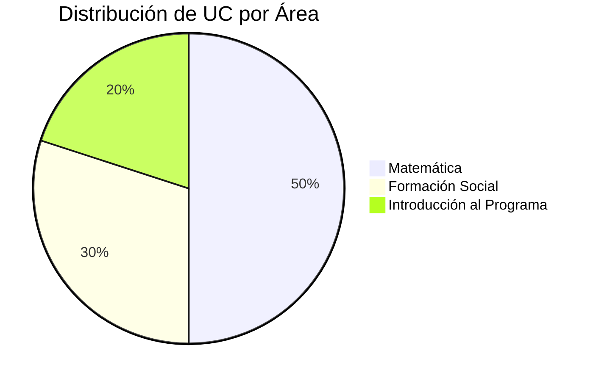

# Trayecto Inicial

El **Trayecto Inicial** es una etapa de nivelación y preparación que garantiza que todos los estudiantes cuenten con las competencias básicas necesarias para iniciar exitosamente el Programa Nacional de Formación en Informática.

## Objetivo General

Proporcionar a los estudiantes las herramientas fundamentales en matemática, conocimiento del contexto nacional y comprensión de la estructura del programa, facilitando una transición efectiva hacia la formación profesional en informática.

## Duración

::: info Duración Estimada
**1 Trimestre** (aproximadamente 12-14 semanas)
:::

## Unidades Curriculares

### 📐 Matemática (5 UC)

**Descripción:**
Fundamentos matemáticos esenciales para la comprensión de algoritmos, lógica de programación y análisis de sistemas.

**Contenidos principales:**
- Álgebra básica
- Funciones y gráficas
- Trigonometría
- Geometría analítica
- Introducción al cálculo
- Lógica matemática

**Habilidades desarrolladas:**
- ✓ Razonamiento lógico-matemático
- ✓ Resolución de problemas
- ✓ Pensamiento analítico
- ✓ Fundamentos para algoritmos

---

### 🇻🇪 Proyecto Nacional y Nueva Ciudadanía (3 UC)

**Descripción:**
Análisis crítico del contexto histórico, político, social y económico de Venezuela, promoviendo la formación de ciudadanos comprometidos con el desarrollo nacional.

**Contenidos principales:**
- Historia contemporánea de Venezuela
- Constitución de la República Bolivariana de Venezuela
- Modelo de desarrollo nacional
- Participación ciudadana
- Soberanía tecnológica
- Ética y valores sociales

**Habilidades desarrolladas:**
- ✓ Pensamiento crítico
- ✓ Conciencia social
- ✓ Compromiso comunitario
- ✓ Comprensión del contexto nacional

---

### 💡 Introducción a los Proyectos y al Programa (2 UC)

**Descripción:**
Orientación sobre la metodología de proyectos sociotecnológicos, la estructura del PNF en Informática y las competencias profesionales a desarrollar.

**Contenidos principales:**
- Estructura del PNF en Informática
- Metodología de proyectos sociotecnológicos
- Perfil del profesional en informática
- Áreas de especialización
- Metodologías de investigación
- Vinculación con la comunidad
- Normas académicas y administrativas

**Habilidades desarrolladas:**
- ✓ Comprensión del programa académico
- ✓ Planificación de trayectoria educativa
- ✓ Metodología de proyectos
- ✓ Orientación profesional

---

## Resumen de Unidades Crédito

| Unidad Curricular | UC | % del Trayecto |
|-------------------|----|----|
| Matemática | 5 | 50% |
| Proyecto Nacional y Nueva Ciudadanía | 3 | 30% |
| Introducción a los Proyectos y al Programa | 2 | 20% |
| **TOTAL** | **10** | **100%** |

## Distribución por Áreas

## Perfil de Egreso del Trayecto

Al completar el Trayecto Inicial, el estudiante estará en capacidad de:

::: tip Competencias Adquiridas
✅ Aplicar conocimientos matemáticos básicos en la resolución de problemas

✅ Comprender el contexto nacional y el rol del profesional informático

✅ Utilizar metodologías de proyectos sociotecnológicos

✅ Identificar las áreas de especialización del PNF en Informática

✅ Planificar su trayectoria académica de forma consciente
:::

## Modalidad de Evaluación

- **Evaluaciones teóricas** (pruebas, exámenes)
- **Trabajos prácticos** (ejercicios, talleres)
- **Proyectos de aula** (investigaciones breves)
- **Participación activa** en clases

## Requisitos de Aprobación

::: warning Requisitos
- **Aprobar todas las unidades curriculares** con un mínimo de 10 puntos (escala de 1 a 20)
- **Asistencia mínima**: 75% de las clases
- **Cumplir con las actividades asignadas** en los plazos establecidos
:::

## Siguiente Paso

::: info Continuación del Programa
Una vez aprobado el Trayecto Inicial, el estudiante avanza al **[Trayecto I - Soporte Técnico a Usuarios y Equipos](trayecto-1.md)**, donde comenzará su formación técnica especializada.
:::

---

## Recursos Adicionales

- [📚 Guía de Usuario](/projects/phase-v-manuals.md)
- [🚀 Comenzar](/guide/beginner-roadmap.md)
- [📖 Volver al Pensum Completo](README.md)
- [📄 Descargar Pensum Oficial (PDF)](/docs/assets/documents/PNFI%202012.pdf)
